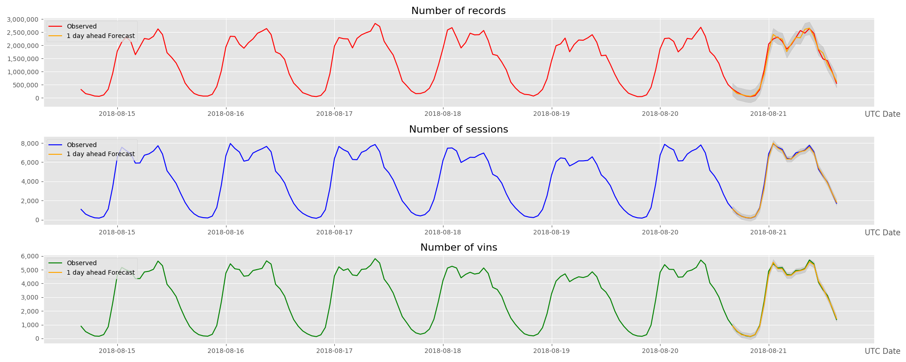

# Telelog Ingestion Monitoring Project

Currently more and more real-time data have been integrated into Datalake platform (e.g. Telelog, RTM data), but we don’t have an automatic tools to monitor the status for the real-time data ingestion. 
This project aims to develop a smart monitoring tool to improve current situation.

This project has been devided into two phases:  

* Phase 1 - Mainly focus on the basic functionalities to help IT operation team to monitor the data ingestion status. For specific cases, e.g.connection lost, empty data, etc. system will automatically send email to appointed email address, a short description for the issue and a general data chart will be attached.   
* Phase 2 - Has extended the functionalities to be able to detect the real-time data ingestion in a normal pattern, or abnormal pattern by leveraging ML technologies. We trained a Time Series Model based on ARIMA, and based on that get 1 day ahead forecast. The chart we plotted looks like as below:   

## Configuration

1. An ODBC data source `mbc_datalake_prod` should be created beforehand to connect to the data lake production system. 
2. The E-mail functionality, training data period, and thresholds of the model can be configured by editing the JSON file in `conf/config.json`
3. The home directory of the application is defined in `main.py` under the variable `app_dir`, this should be changed to the applications root structure before running.

## Running

The submission scripts also have hard coded application directories, so make sure to edit those before you run them.

After making the necessary configurations you can run the application by using `scripts/telelog_monitoring.bat`.

## Scheduling

Currently this application is scheduled to run every day, using the Windows Job scheduling `taskschd.msc`